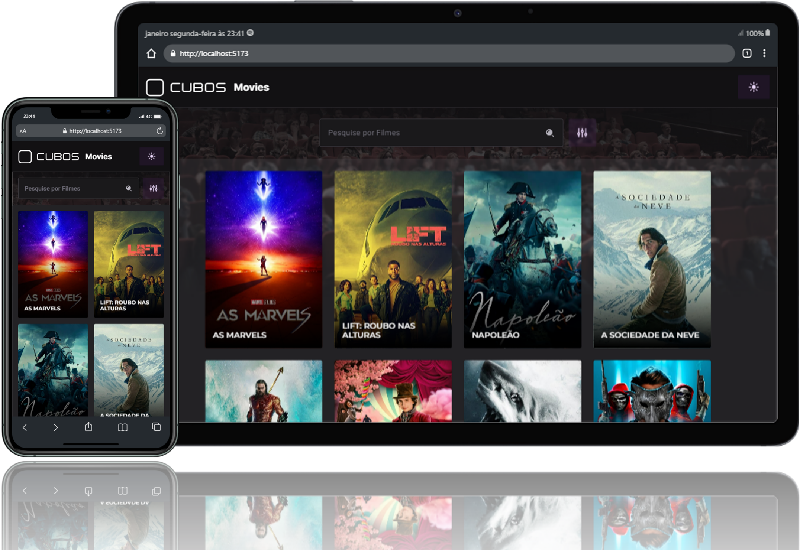

# Desafio front-end - Cubos Tecnologia

<div align="center"></div>

Continuação do desenvolvimento da aplicação em Vue (pós prazo) para buscar informações sobre filmes utilizando a API TMDB, proposto pela Cubos Tecnologia.

## Instalar, configurar e executar a aplicação

Para instalar as dependências utilize o comando:

```console
npm install
```

No arquivo `.env.example` substitua `YOUR_API_KEY` pela sua chave da API TMDB. Depois renomeie o arquivo para `.env`.

O projeto foi criado utilizando Vite + Vue, conforme recomendado pela [documentação oficial](https://vuejs.org). Então, para rodar a aplicação localmente, utilize o comando:

```console
npm run dev
```

## Tecnologias utilizadas

- **Vite.js**: Build Tool, criada pelo próprio Evan You e indicada na [documentação oficial](https://vuejs.org/guide/quick-start.html#creating-a-vue-application). Proporciona rapidez e agilidade no processo de compilação e desenvolvimento.
- **Typescript**: para adicionar tipagem estática e ajudar na detecção de erros no código.
- **Sass**: para estilização mais eficiente dos componentes.
- **Tanstack Query**: para gerenciamento automático de estado e requisições rápidas e eficientes.

## Comandos úteis

Com a aplicação rodando, na linha de comando:

- Tecla "o" abre a aplicação no navegador.
- Tecla "q" encerra a aplicação.
- Tecla "h" mostra todos os comandos disponíveis.
